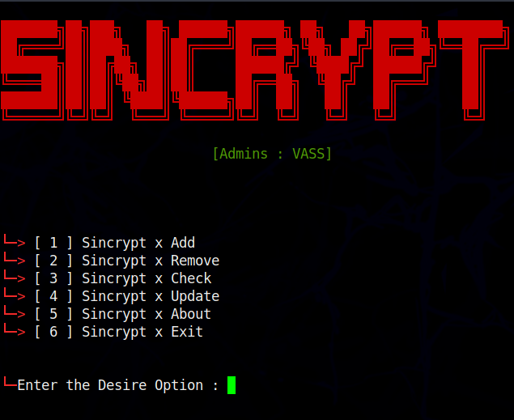

# Sincryption Team Panel
 

- What is Sincryption team panel  ?
> This is panel which you can add members to sincryption team 
> You can remove the member from sincryption if we grant you 
> To add and remove grant permission you will need one admin key 
> Admin key will be only available for co-founders of team.
> this tool made by @samay825 

 

- Sincryption Panel

* `No errors without spelling mistakes 

* `Supports newest Android also.`

* `Instant check ,add,remove.`

* `Working with all Operators/Carriers.`

* `No missing API issues, all codes written by me .`

*  For Contact Instagram : sincryptzork 

 

- Support

> `termux and all linux os windows.etc..`

> `All over world.`

> `Update will be soon.`
 
  

- Installation & Step's
 
> `apt update && apt upgrade`

> `git clone https://github.com/samay825/Sincryption.git`

> `cd Sincryption`

> `chmod +x *`

> `pip install -r requirements.txt`

> `python3 main.py or python main.py`
 
